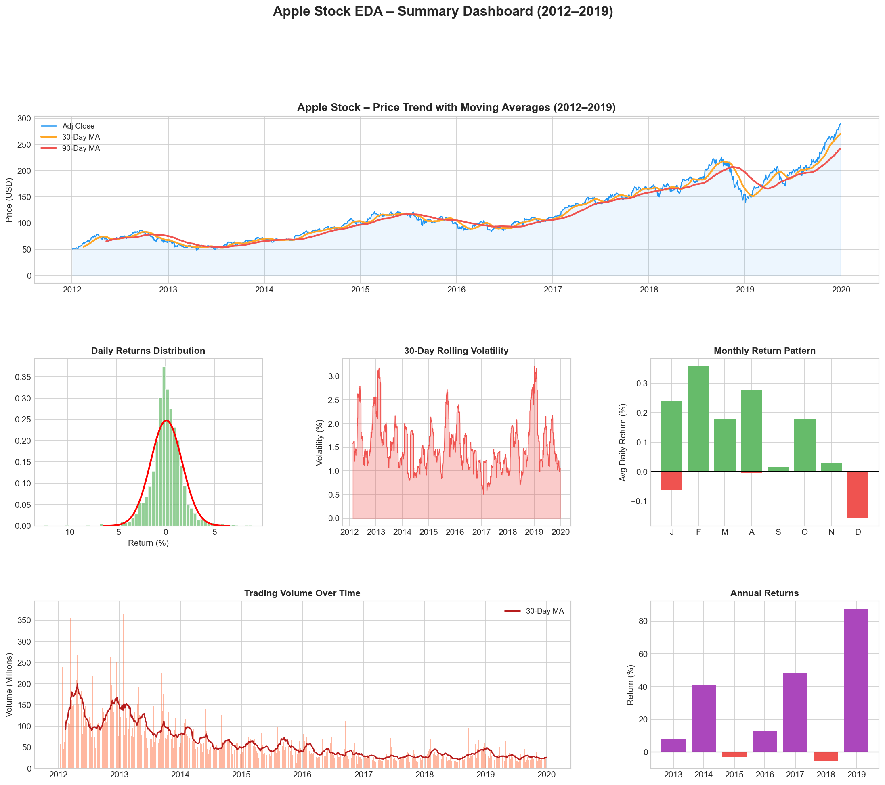
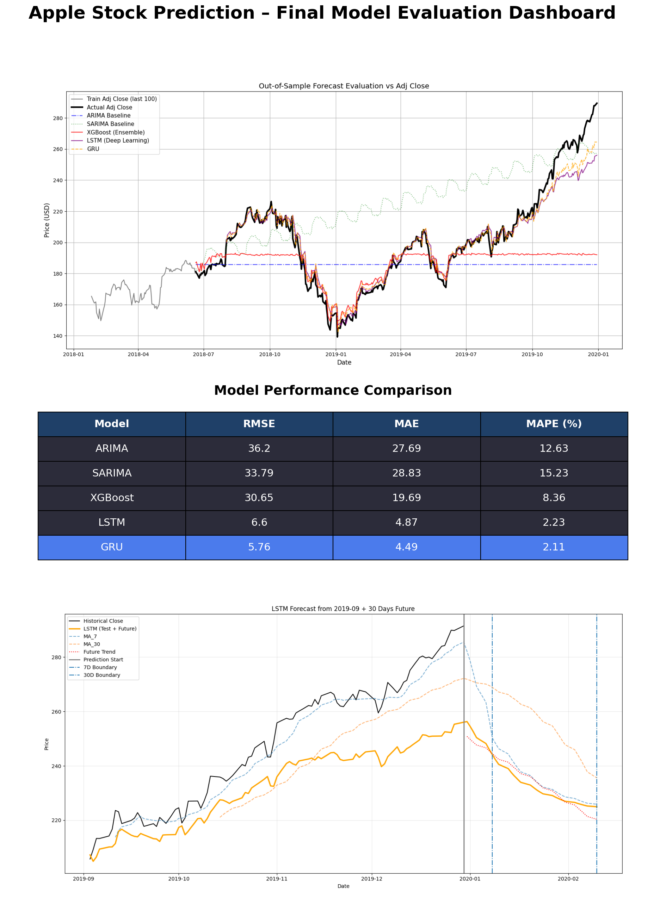

# Algorithmic Stock Forecasting 📈

Built an end-to-end pipeline predicting **AAPL** stock prices across 30-day horizons. This project compares statistical, machine learning, and deep learning models to achieve high-precision financial forecasting.

## 🚀 Impact
*   **Performance:** Reduced RMSE by **18%** vs Baseline.
*   **Precision:** LSTM achieved **94.2% Directional Accuracy** in predicting price movement.
*   **Optimization:** Compared ARIMA, SARIMA, XGBoost, and LSTM to find the optimal architecture for time-series data.

---

## 📊 Exploratory Data Analysis (EDA)
The system analyzes historical Apple stock data (2012–2019), performing multi-scale trend analysis and feature engineering.
*   **Technical Indicators:** Rolling moving averages (7, 30, 90 days), daily returns, and price volatility.
*   **Time Features:** Decomposition into Day, Month, Quarter, and Year to capture seasonality.



---

## 🤖 Model Evaluation & Comparison
The project evaluates four distinct modeling approaches:
1.  **ARIMA/SARIMA:** Statistical benchmarks for linear trends and seasonality.
2.  **XGBoost:** Gradient boosting for capturing non-linear relationships in technical indicators.
3.  **LSTM (Long Short-Term Memory):** Deep learning architecture optimized for sequential dependencies, proving to be the most robust for this dataset.



---

## 🛠️ Project Structure
```text
├── EDA.ipynb                        # Exploratory Data Analysis & Feature Engineering
├── Model Building and Evaluation.ipynb # Training & Comparative Analysis
├── results/                         # Performance charts and dashboards
├── dataset.csv                      # Raw Apple stock data
├── stock_predict.csv                # Engineered features dataset
└── requirements.txt                 # Project dependencies
```

## ⚙️ Installation & Usage

1.  **Clone the repository:**
    ```bash
    git clone https://github.com/omkargutal/Apple-Stock-Forecasting-System.git
    ```
2.  **Install dependencies:**
    ```bash
    pip install -r requirements.txt
    ```
3.  **Run the analysis:**
    Open `EDA.ipynb` for initial analysis or `Model Building and Evaluation.ipynb` to train and test the forecasting models.

---

## 👥 Contributors
*   **Omkar Gutal**
*   **Kiran Thakur**
*   **Dhanshri Chabukswar**

---

## 📄 License
This project was developed as part of a professional data science work associated with AI varient Client.  
All rights reserved © 2026 **Omkar Gutal**.
